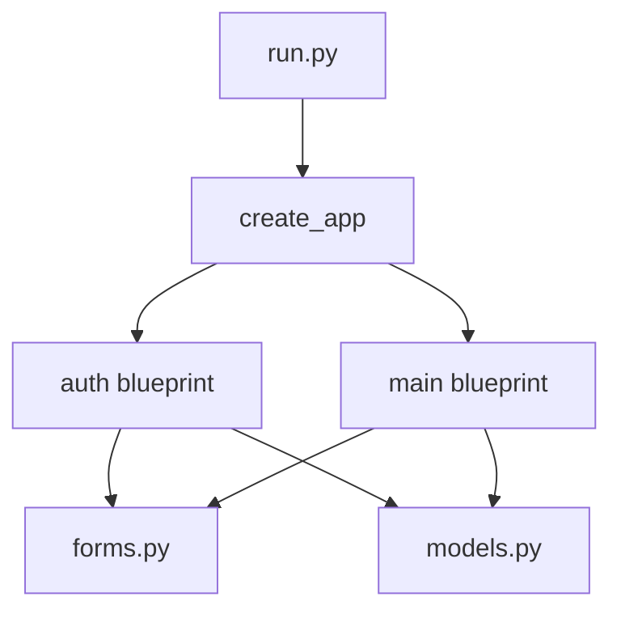
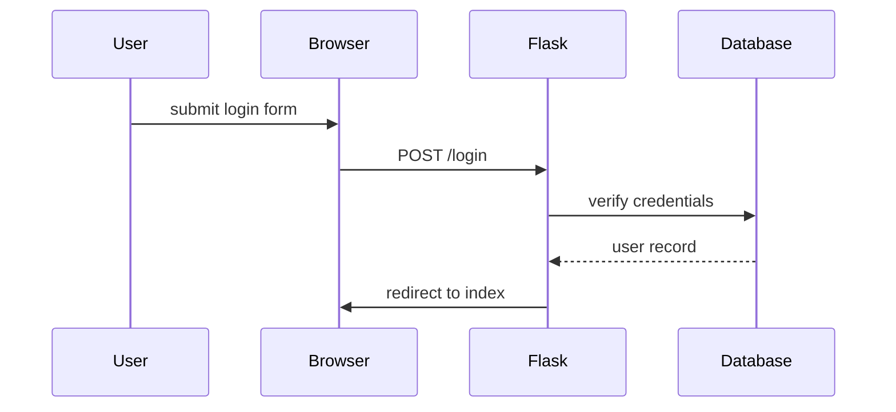

# Flask Example

This project is a small demonstration of a web application built with Flask. It
shows how to organize routes, templates, forms and a database using common
Flask extensions.

## Features

- SQLite database managed with SQLAlchemy
- Simple authentication with Flask-Login
- Contact form handled by Flask-WTF
- Bootstrap-based templates rendered with Jinja2
- API endpoint that returns contact data as JSON

## Setup

### Windows (PowerShell)

1. Create a virtual environment and activate it:

```powershell
python -m venv venv
venv\Scripts\Activate.ps1
```

2. Install the dependencies:

```powershell
pip install -r requirements.txt
```

3. Initialize the database:

```powershell
python -c "from app import create_app, db; app = create_app(); app.app_context().push(); db.create_all()"
```

4. Run the development server:

```powershell
python run.py
```

### Linux/macOS

1. Create a virtual environment and activate it:

```bash
python3 -m venv venv
source venv/bin/activate
```

2. Install the dependencies:

```bash
pip install -r requirements.txt
```

3. Initialize the database:

```bash
python3 -c "from app import create_app, db; app = create_app(); app.app_context().push(); db.create_all()"
```

4. Run the development server:

```bash
python3 run.py
```

### Access the Application

Open `http://localhost:5000` in a browser to see the application.

#### Available Routes:
- `/` - Home page
- `/login` - User login
- `/register` - User registration
- `/contact` - Contact form
- `/api/contacts` - JSON API for contacts data
- `/logout` - Logout (redirects to home)

## Neo-Cyberpunk Theme

The templates now include a dark interface with neon colors inspired by cyberpunk aesthetics. Use the **Glow** slider in the navigation bar to adjust the intensity of the neon effects in real time.

## File Overview

The repository is organized as follows:

- `run.py` – entry point that starts the development server and exposes objects in the Flask shell.
- `config.py` – configuration class with the secret key and database settings.
- `app/` – main application package containing:
  - `__init__.py` – application factory; initializes SQLAlchemy, Flask-Login and CSRF protection and registers blueprints.
  - `auth.py` – authentication blueprint with routes for login, logout and registration.
  - `forms.py` – defines the WTForms used by authentication and the contact page.
  - `main.py` – blueprint with the home page, contact form and JSON API for contacts.
  - `models.py` – SQLAlchemy models `User` and `Contact` used across the app.
  - `static/` – neon style sheet (`style.css`) and slider logic (`theme.js`).
  - `templates/` – base layout and templates for each page.
- `requirements.txt` – Python dependencies.
- `documentation.md` – extended documentation in Spanish.

## Component Relationships



### Request Flow

The following ASCII diagram outlines a typical request cycle:

```
Browser -> Flask route -> Blueprint handler -> Database (via models) -> Template -> Response
```


### Authentication Sequence




